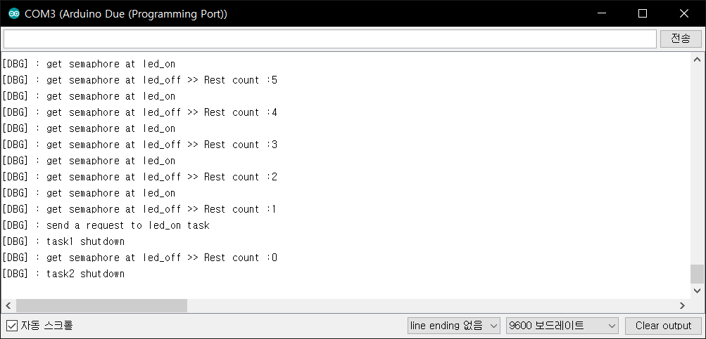

*********************************************************************************************************
#                                                uC/OS-II
#                                          The Real-Time Kernel

                              (c) Copyright 1992-2013, Micrium, Weston, FL
                                           All Rights Reserved

 
 By      : Jean J. Labrosse
 Version : V2.92.10

 LICENSING TERMS:
 ---------------
   uC/OS-II is provided in source form for FREE evaluation, for educational use or for peaceful research.
 If you plan on using  uC/OS-II  in a commercial product you need to contact Micrium to properly license
 its use in your product. We provide ALL the source code for your convenience and to help you experience
 uC/OS-II.   The fact that the  source is provided does  NOT  mean that you can use it without  paying a
 licensing fee.
*********************************************************************************************************

MicroC/OS for Arduino boards based on ARM Cortex M3 like Arudino Due.
This source code should be used just for education or research according to uC/OS-II's licensing terms.

* OS_TASK_TMR_PRIO is defined as priority 15 in cf/oscfg.h

Revised by hongkyun

*********************************************************************************************************

# Install uCOS-II library for Ardunino IDE in Linux

  git clone https://github.com/Gibartes/uCOS-II-Arduino_Due.git
  
  Copy or unzip uCOS-II file to ~/Arduino/libraries 
  
  or just copy or type below command
  
  cd uCOS-II-Arduino_Due-master/uCOS_II ; bash install.sh ; cd -
  
# Install uCOS-II library for Ardunino IDE in Windows

  Copy or unzip uCOS-II file to C:\Users\\[Your ID]\Documents\Arduino\libraries
  

